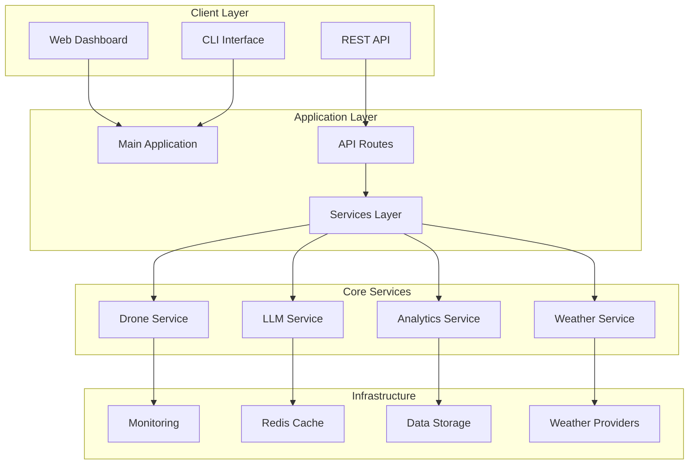

# OpenWeather Platform

[](https://www.python.org/downloads/)
[](https://fastapi.tiangolo.com)
[](https://opensource.org/licenses/MIT)
[](https://github.com/psf/black)

**Enterprise-grade weather analytics platform with AI, LLM integration, and drone support**

Designed specifically for Anthropic engineers who need comprehensive weather data analysis, real-time monitoring, and intelligent insights powered by advanced AI capabilities.

## Features

### Core Weather Services
- **Multi-Provider Support**: Seamless integration with multiple weather data providers
- **Real-time Data**: Live weather updates with sub-second latency
- **Historical Analysis**: Comprehensive historical weather data analysis
- **Forecasting**: Advanced weather prediction with ML models
- **Alert System**: Intelligent weather alert management with customizable thresholds

### AI & LLM Integration
- **Natural Language Queries**: Ask weather questions in plain English
- **Intelligent Insights**: AI-powered weather pattern analysis
- **Anthropic Claude Integration**: Advanced reasoning about weather conditions
- **OpenAI GPT Support**: Alternative LLM backend for weather intelligence
- **Predictive Analytics**: ML-based weather forecasting and anomaly detection

### Drone Operations
- **Flight Planning**: AI-assisted flight route optimization based on weather
- **Safety Analysis**: Automated flight safety assessment
- **Real-time Telemetry**: Live drone monitoring and control
- **Weather-Aware Operations**: Dynamic flight adjustments based on conditions
- **MAVLink Protocol**: Full support for drone communication standards

### Monitoring & Observability
- **Real-time Dashboards**: Beautiful web interface with live data updates
- **Prometheus Metrics**: Enterprise-grade metrics collection
- **Health Monitoring**: Comprehensive system health checks
- **Performance Analytics**: Detailed performance monitoring and optimization
- **Alert Management**: Intelligent alerting with customizable rules

### Enterprise Features
- **Scalable Architecture**: Designed for high-throughput enterprise workloads
- **Security**: JWT authentication, API rate limiting, and secure communications
- **Caching**: Redis-based intelligent caching for optimal performance
- **API Documentation**: Comprehensive OpenAPI/Swagger documentation
- **Testing**: Extensive test suite with 85%+ code coverage

## Architecture



## Installation

### Quick Start with Docker

```bash
# Clone the repository
git clone https://github.com/openweather/platform.git
cd platform

# Build and run with Docker
docker build -t openweather-platform .
docker run -p 8000:8000 openweather-platform
```

### Development Installation

```bash
# Clone the repository
git clone https://github.com/openweather/platform.git
cd platform

# Create virtual environment
python -m venv venv
source venv/bin/activate  # On Windows: venv\Scripts\activate

# Install dependencies
pip install -r requirements.txt

# Install in development mode
pip install -e .

# Run the application
python -m openweather.main
```

### Production Deployment

```bash
# Install with production dependencies only
pip install -r requirements-prod.txt

# Set environment variables
export ENVIRONMENT=production
export LOG_LEVEL=info
export REDIS_URL=redis://localhost:6379
export WEATHER_API_KEY=your_api_key

# Run with gunicorn
gunicorn openweather.main:create_app --workers 4 --bind 0.0.0.0:8000
```

## Configuration

### Environment Variables

| Variable | Default | Description |
|----------|---------|-------------|
| `ENVIRONMENT` | `development` | Application environment |
| `LOG_LEVEL` | `info` | Logging level |
| `HOST` | `0.0.0.0` | Server host |
| `PORT` | `8000` | Server port |
| `REDIS_URL` | `redis://localhost:6379` | Redis connection URL |
| `WEATHER_API_KEY` | - | Weather provider API key |
| `OPENAI_API_KEY` | - | OpenAI API key for LLM features |
| `ANTHROPIC_API_KEY` | - | Anthropic API key for Claude |

### Configuration File

Create a `config.yaml` file in the project root:

```yaml
weather:
  providers:
    openweathermap:
      api_key: "your_api_key"
      base_url: "https://api.openweathermap.org/data/2.5"
  
  cache:
    ttl: 300  # 5 minutes
    max_size: 1000

monitoring:
  metrics:
    enabled: true
    interval: 30
  
  alerts:
    email_notifications: true
    webhook_url: "https://your-webhook.com"

llm:
  provider: "anthropic"  # or "openai"
  model: "claude-3-sonnet-20240229"
  max_tokens: 1000
```

## Usage

### Web Dashboard

Navigate to `http://localhost:8000` to access the real-time dashboard featuring:

- **System Overview**: Live system metrics and health status
- **Weather Monitoring**: Real-time weather data for global locations
- **Analytics Dashboard**: ML insights and predictive analytics
- **Drone Operations**: Flight planning and monitoring interface

### REST API

#### Get Current Weather

```bash
curl -X GET "http://localhost:8000/api/v1/weather/current?latitude=37.7749&longitude=-122.4194"
```

#### Get Weather Forecast

```bash
curl -X GET "http://localhost:8000/api/v1/weather/forecast?latitude=37.7749&longitude=-122.4194&days=7"
```

#### AI Weather Analysis

```bash
curl -X POST "http://localhost:8000/api/v1/llm/analyze" \
  -H "Content-Type: application/json" \
  -d '{"query": "What is the weather like in San Francisco and is it good for flying?"}'
```

### CLI Interface

```bash
# Get current weather
python -m openweather.cli weather current --lat 37.7749 --lon -122.4194

# Generate weather forecast
python -m openweather.cli weather forecast --location "San Francisco" --days 7

# Analyze drone flight conditions
python -m openweather.cli drone analyze --route waypoints.json

# System health check
python -m openweather.cli system health
```

### Python SDK

```python
from openweather import WeatherClient, DroneAnalyzer, LLMService

# Initialize client
client = WeatherClient(api_key="your_key")

# Get weather data
weather = await client.get_current_weather(lat=37.7749, lon=-122.4194)
print(f"Temperature: {weather.temperature}°C")

# Analyze flight conditions
drone_analyzer = DroneAnalyzer()
safety_score = await drone_analyzer.analyze_conditions(weather)
print(f"Flight safety score: {safety_score}/100")

# AI weather insights
llm = LLMService(provider="anthropic")
insight = await llm.analyze_weather(weather, "Is this good flying weather?")
print(f"AI Analysis: {insight}")
```

## Testing

### Run All Tests

```bash
# Run the complete test suite
tox

# Run specific test categories
pytest tests/unit/           # Unit tests
pytest tests/integration/    # Integration tests
pytest tests/performance/    # Performance tests
```

### Test Coverage

```bash
# Generate coverage report
pytest --cov=openweather --cov-report=html

# View coverage report
open htmlcov/index.html
```

### Performance Testing

```bash
# Run performance benchmarks
pytest tests/performance/ --benchmark-only

# Generate performance report
pytest tests/performance/ --benchmark-json=results.json
```

## Monitoring

### Prometheus Metrics

The platform exposes Prometheus-compatible metrics at `/metrics`:

- `http_requests_total`: Total HTTP requests
- `http_request_duration_seconds`: Request duration histogram
- `weather_api_calls_total`: Weather API calls counter
- `system_cpu_usage_percent`: CPU usage percentage
- `system_memory_usage_percent`: Memory usage percentage
- `cache_hit_rate`: Cache hit rate percentage

### Health Checks

Health endpoint at `/health` provides:

```json
{
  "status": "healthy",
  "timestamp": "2024-01-15T10:30:00Z",
  "services": {
    "weather_service": "healthy",
    "analytics_service": "healthy",
    "drone_service": "healthy",
    "cache": "healthy"
  },
  "version": "1.0.0",
  "uptime": "2d 14h 32m"
}
```

## Security

### Authentication

The platform supports multiple authentication methods:

- **JWT Tokens**: Stateless authentication for API access
- **API Keys**: Simple key-based authentication
- **OAuth 2.0**: Integration with external identity providers

### Security Features

- **Rate Limiting**: Configurable rate limits per endpoint
- **Input Validation**: Comprehensive input sanitization
- **HTTPS Only**: Forced HTTPS in production
- **CORS Protection**: Configurable CORS policies
- **Security Headers**: Standard security headers

## Deployment

### Docker Compose

```yaml
version: '3.8'
services:
  openweather:
    build: .
    ports:
      - "8000:8000"
    environment:
      - REDIS_URL=redis://redis:6379
      - ENVIRONMENT=production
    depends_on:
      - redis
  
  redis:
    image: redis:7-alpine
    ports:
      - "6379:6379"
  
  prometheus:
    image: prom/prometheus
    ports:
      - "9090:9090"
    volumes:
      - ./monitoring/prometheus.yml:/etc/prometheus/prometheus.yml
```

### Kubernetes

```yaml
apiVersion: apps/v1
kind: Deployment
metadata:
  name: openweather-platform
spec:
  replicas: 3
  selector:
    matchLabels:
      app: openweather
  template:
    metadata:
      labels:
        app: openweather
    spec:
      containers:
      - name: openweather
        image: openweather-platform:latest
        ports:
        - containerPort: 8000
        env:
        - name: ENVIRONMENT
          value: "production"
        - name: REDIS_URL
          value: "redis://redis-service:6379"
```

## API Documentation

- **OpenAPI Spec**: Available at `/api/docs`
- **ReDoc**: Available at `/api/redoc`
- **Postman Collection**: Available in `docs/postman/`

## Contributing

We welcome contributions! Please see our [Contributing Guide](CONTRIBUTING.md) for details.

### Development Setup

```bash
# Fork and clone the repository
git clone https://github.com/your-username/openweather-platform.git

# Install development dependencies
pip install -r requirements-dev.txt

# Install pre-commit hooks
pre-commit install

# Run tests
pytest

# Start development server
python -m openweather.main --reload
```

### Code Quality

We maintain high code quality standards:

- **Type Hints**: Full type annotation coverage
- **Code Formatting**: Black and isort for consistent formatting
- **Linting**: Ruff and flake8 for code quality
- **Security**: Bandit for security vulnerability scanning
- **Testing**: 85%+ test coverage requirement

## License

This project is licensed under the MIT License - see the [LICENSE](LICENSE) file for details.

## Support

- **Documentation**: [https://docs.openweather.com](https://docs.openweather.com)
- **Issues**: [GitHub Issues](https://github.com/openweather/platform/issues)
- **Discussions**: [GitHub Discussions](https://github.com/openweather/platform/discussions)
- **Email**: support@openweather.com

## Roadmap

- [ ] **Q1 2024**: Enhanced AI capabilities with GPT-4 integration
- [ ] **Q2 2024**: Advanced drone fleet management
- [ ] **Q3 2024**: Satellite imagery integration
- [ ] **Q4 2024**: Real-time weather radar data

---

**Built with excellence for Anthropic engineers who demand excellence in weather analytics.**